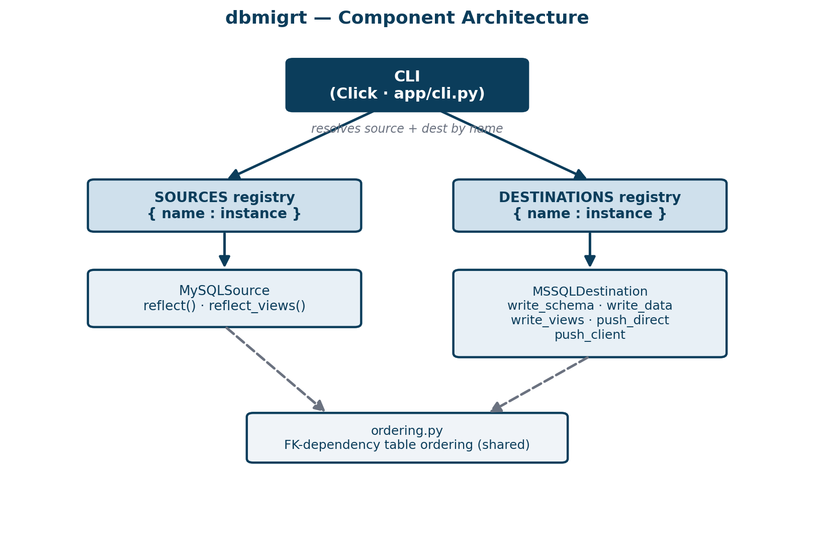
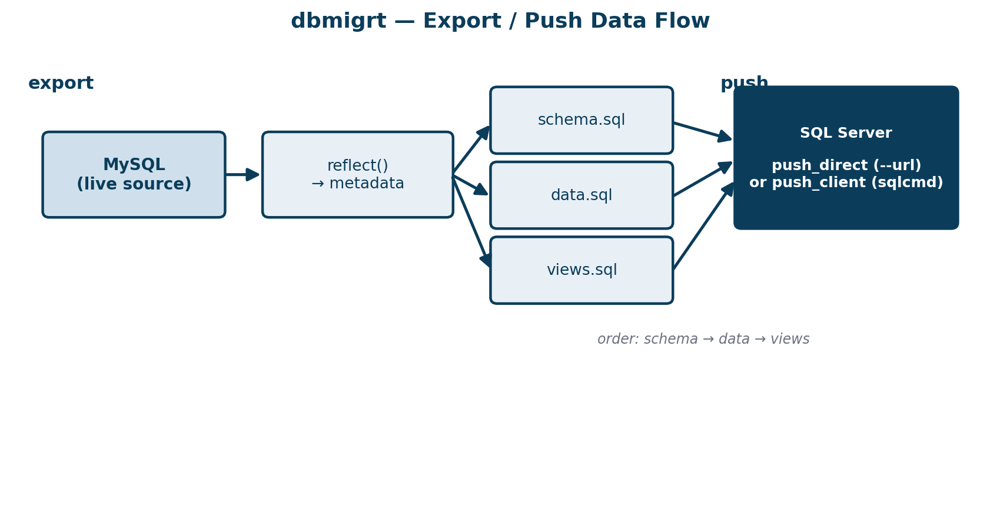

# Software Design Document — dbmigrt

**Status:** Draft · **Version:** 0.1.0 · **Last updated:** 2026-06-28

---

## 1. Introduction

### 1.1 Purpose
This document describes the design of **dbmigrt**, a command-line tool that
migrates a relational database from a *source* engine to a *destination* engine
by generating destination-compatible SQL and optionally applying it. It is
intended for developers maintaining or extending the tool.

### 1.2 Scope
The current release migrates **MySQL → SQL Server**. It reflects a live source
schema, emits `schema.sql` and `data.sql` in the destination dialect, and pushes
them either through a database driver or the destination's client binary. Views are exported to a separate file. The
design generalises to additional engines through registries.

Out of scope for 0.1.0: stored procedures, triggers, incremental/CDC sync,
and cross-engine type customisation beyond SQLAlchemy's defaults. Views are
exported with best-effort dialect translation (see §5.3).

### 1.3 Definitions
- **Source** — an engine dbmigrt reads from by reflection.
- **Destination** — an engine dbmigrt writes SQL for and pushes to.
- **Reflection** — deriving table/column/constraint metadata from a live DB.
- **Push** — applying generated SQL to a destination.
- **SDD** — this Software Design Document.

---

## 2. Goals and non-goals

### 2.1 Goals
1. Migrate schema and data without requiring the source application's code.
2. Preserve primary-key values so foreign-key relationships remain valid.
3. Produce reviewable, runnable SQL artifacts (schema and data, separately).
4. Work across a network boundary: export on one host, push on another, or
   hand-carry the files.
5. Be extensible to new engines without modifying the CLI.

### 2.2 Non-goals
1. 100% automatic translation of every type/feature (acknowledged impossible
   between heterogeneous engines).
2. Live replication or zero-downtime cutover.
3. A GUI.

---

## 3. Requirements

### 3.1 Functional
- **FR1** Reflect a live MySQL database from a connection URL.
- **FR2** Generate SQL Server-compatible `schema.sql` (tables + indexes).
- **FR3** Generate `data.sql` with all row data as INSERT statements.
- **FR4** Preserve primary-key/identity values exactly.
- **FR5** Produce schema and data as separate files in an output directory.
- **FR5a** Export views to a separate `views.sql` file when present.
- **FR6** Push files to SQL Server via a driver (`--url`) or `sqlcmd`
  (`--client`).
- **FR7** Select source/destination via `--from`/`--to`, validated against
  what is registered.

### 3.2 Non-functional
- **NFR1 (Correctness)** Output must load into a clean SQL Server DB with
  referential integrity intact.
- **NFR2 (Portability)** Single self-contained binary buildable per-OS via
  PyInstaller.
- **NFR3 (Extensibility)** Adding an engine requires no CLI changes.
- **NFR4 (Operability)** Export and push are independent steps usable on
  separate hosts.
- **NFR5 (Testability)** Core logic testable without live MySQL/MSSQL.

---

## 4. High-level architecture

dbmigrt is a thin CLI over two plug-in registries. The CLI resolves a source
and a destination object, then orchestrates a two-phase flow (export, push).
All engine-specific behaviour lives behind the `Source` and `Destination`
interfaces.




### 4.1 Component responsibilities
- **CLI (`app/cli.py`)** — argument parsing, mode validation, orchestration.
  Contains no engine-specific logic; `--from`/`--to` options are generated from
  registry keys.
- **Source (`app/sources/`)** — `reflect(url) -> (engine, metadata)`. The
  engine is reused for streaming reads during data export.
- **Destination (`app/destinations/`)** — converts `MetaData` to dialect SQL
  and applies it. Owns identity handling, FK toggling, batching, and the push
  transports.
- **Ordering (`app/ordering.py`)** — single source of truth for parent-first
  table ordering with a safe fallback on cycles.

### 4.2 Data flow

Export reflects the source and writes one file per artifact; push applies them
in dependency order (schema, then data, then views).



---

## 5. Detailed design

### 5.1 Source interface
```python
class Source:
    name: str
    def reflect(self, url) -> tuple[Engine, MetaData]
    def reflect_views(self, engine) -> list[tuple[str, str]]
```
`MySQLSource` uses SQLAlchemy's default table reflection and reads view
definitions from `information_schema.VIEWS`. Subclasses override either method
only when an engine needs special handling (e.g. schema selection).

### 5.2 Destination interface
```python
class Destination:
    name: str
    dialect: Dialect
    def write_schema(self, path, md)
    def write_data(self, path, engine, md)
    def write_views(self, path, views)
    def push_direct(self, url, files)
    def push_client(self, files, server, database, extra)
```

### 5.3 MSSQL destination behaviour
**Schema** — emits `CREATE TABLE` per table in FK order via the SQLAlchemy
MSSQL dialect, followed by non-PK indexes. Each statement terminated with `GO`.

**Data** — wraps the whole load between disabling and re-validating FK
constraints, and emits batched multi-row INSERTs:

```
SET NOCOUNT ON
ALTER TABLE [t] NOCHECK CONSTRAINT ALL        -- for every table
  per table:
    SET IDENTITY_INSERT [t] ON                 -- iff single autoinc int PK
    INSERT INTO [t] (...) VALUES (...), ...     -- <= 1000 rows/statement
    SET IDENTITY_INSERT [t] OFF
ALTER TABLE [t] WITH CHECK CHECK CONSTRAINT ALL  -- re-validate
```

**Identity detection** — `IDENTITY_INSERT` is emitted only for tables whose
primary key is a single auto-increment integer column; other tables are
inserted normally to avoid errors.

**Push** — `push_direct` opens a transactional connection and executes the
script in `GO`-delimited batches. `push_client` shells out to `sqlcmd` with
UTF-8 (`-f 65001`) and abort-on-error (`-b`).

**Views** — `write_views` emits each view as a `CREATE VIEW` statement in its
own `GO` batch (required, since `CREATE VIEW` must be the first statement in a
batch). View bodies are reflected from the source and translated best-effort to
the destination dialect; for MSSQL this currently converts backtick identifiers
to bracket identifiers. The output file carries an explicit note that complex
expressions (functions, `LIMIT`/`TOP`, date handling) may need manual review.
Views are applied last because they may reference tables and data.

### 5.4 Table ordering
`ordered_tables(md)` returns `md.sorted_tables` (parent-first). On
`CircularDependencyError` it warns and falls back to name order; this is safe
because FK enforcement is disabled during the data load.

### 5.5 CLI flows
**export:** `reflect` → `write_schema` → `write_data` → `reflect_views` → `write_views` into `--out`.
**push:** validate files exist → choose `push_direct` (`--url`) or
`push_client` (`--client -S -d`); schema applied before data.

---

## 6. Data design

dbmigrt holds no persistent state of its own. Its artifacts are two text files:

| File         | Content                                                   |
|--------------|-----------------------------------------------------------|
| `schema.sql` | `CREATE TABLE` + index DDL, FK-ordered, `GO`-batched.     |
| `data.sql`   | FK-disable preamble, batched INSERTs, FK re-enable coda.  |
| `views.sql`  | `CREATE VIEW` statements, one per `GO` batch (optional).  |

Row values are inlined as dialect literals (`literal_binds`), making the files
standalone and runnable by any SQL Server client.

---

## 7. Key design decisions and rationale

| # | Decision | Rationale | Trade-off |
|---|----------|-----------|-----------|
| D1 | Reflect the live DB rather than import app models | Works against any database; no coupling to the source app | Misses app-level semantics not in the schema |
| D2 | Separate schema and data files | Reviewable, independently runnable, re-runnable | Two artifacts to manage |
| D3 | Preserve PKs via `IDENTITY_INSERT` + inlined values | Keeps FK references valid across the move | Larger files than parameterised inserts |
| D4 | Disable FKs during load, re-validate after | Removes ordering fragility (self-ref/cyclic FKs); surfaces orphans at the end | Brief window with constraints off |
| D5 | Registries for sources/destinations | New engines need no CLI change | Slight indirection |
| D6 | Two push transports (driver / sqlcmd) | Works with or without an ODBC driver installed | Two code paths to maintain |
| D7 | Inline literals (`literal_binds`) | Files are portable and client-agnostic | No parameter reuse; larger output |

---

## 8. Error handling

- **Missing artifacts** — `push` checks both files exist and aborts clearly.
- **Mode misuse** — selecting neither `--url` nor `--client` raises a usage
  error; `--client` without `-S/-d` is rejected.
- **Batch failure (direct)** — the offending batch index and file are reported,
  then the exception re-raises inside the open transaction.
- **Batch failure (sqlcmd)** — `-b` makes sqlcmd return non-zero;
  `subprocess.run(check=True)` propagates it.
- **Orphaned FKs** — surfaced by `WITH CHECK CHECK CONSTRAINT ALL` at the end of
  the data load, which is the correct place to detect them.

---

## 9. Testing strategy

Tests use **SQLite** as a stand-in source so CI requires no live databases; the
same SQLAlchemy reflection path exercises ordering, identity detection, FK
wrapping, and batch generation. Current coverage asserts: registry wiring,
FK-ordered schema and data, presence of `IDENTITY_INSERT` and FK-toggle
wrapping, preserved id literals, and `GO`-batch splitting. New destinations
should ship analogous invariant tests.

---

## 10. Deployment

Installed as a console script (`dbmigrt`) via `pip install .`, or built into a
single binary with PyInstaller per target OS. Typical split-host use: build a
Linux binary to `export` near MySQL, a Windows binary to `push` near SQL
Server, transferring the `out/` directory between them.

---

## 11. Future work

- Postgres source and destination (the registries are ready for it).
- `--dry-run` reporting row counts and flagging risky type mappings
  (unsigned ints, JSON, TEXT/BLOB).
- `--tables` include/exclude filtering.
- Optional view/procedure translation passes.
- Parameterised/bulk-copy data path for very large tables.

---

## 12. Traceability

| Requirement | Realised by |
|-------------|-------------|
| FR1 | `app/sources/mysql.py`, `Source.reflect` |
| FR2 | `MSSQLDestination.write_schema` |
| FR3 | `MSSQLDestination.write_data` |
| FR4 | `_has_identity` + `IDENTITY_INSERT` + `literal_binds` |
| FR5 | `cli.export` (`schema.sql`, `data.sql` in `--out`) |
| FR5a | `Source.reflect_views` + `MSSQLDestination.write_views` (`views.sql`) |
| FR6 | `push_direct`, `push_client` |
| FR7 | registry-driven `--from`/`--to` choices |
| NFR1 | FK toggling + ordering + identity preservation |
| NFR2 | PyInstaller single-file build |
| NFR3 | `SOURCES` / `DESTINATIONS` registries |
| NFR4 | independent `export` / `push` commands |
| NFR5 | SQLite-based test suite |
